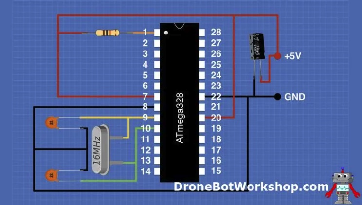
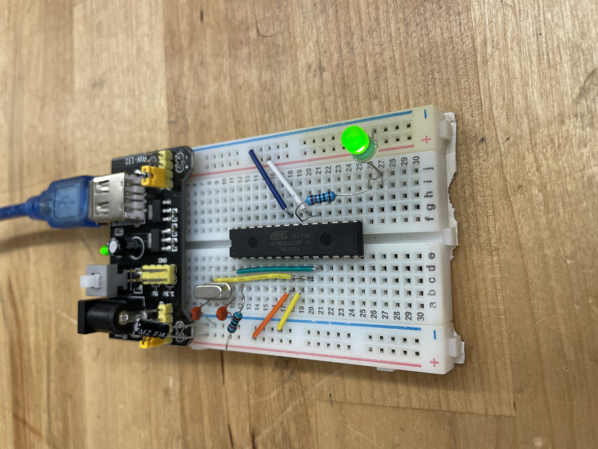
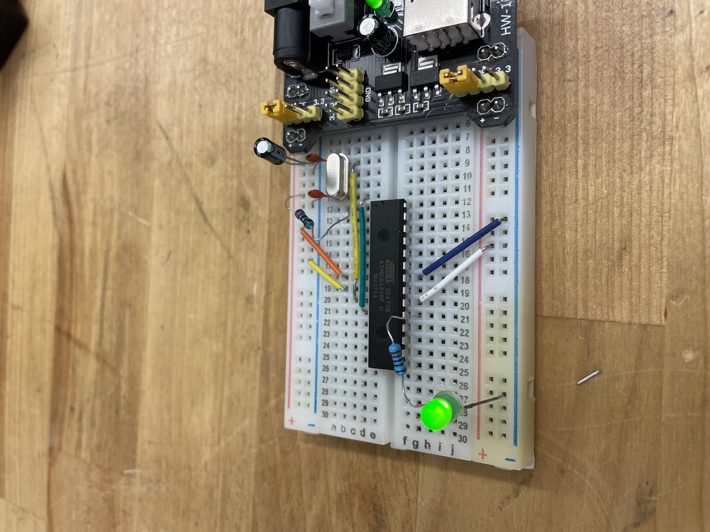

## Test Requirements:
Setup the atmega328p chip by itself (no helper board).

## File Requirements:
1. List required items needed.
- One ATMEGA328P Chip
- One 16MHz Crystal
- One 10K Resistor
- Two 22pF Capacitors
- Optional: One 10uF Capacitor (This is used to filter out power supply noise)

Required for Blinking LED Test:
- One LED
- One 220K Resistor


3. Ardunio Code.  
Test Code to Test with Blinking LED
```C++
// the setup function runs once when you press reset or power the board
void setup() {
  // initialize digital pin LED_BUILTIN as an output.
  pinMode(13, EOUTPUT);
}

// the loop function runs over and over again forever
void loop() {
  digitalWrite(13, HIGH);   // turn the LED on (HIGH is the voltage level)
  delay(1000);                       // wait for a second
  digitalWrite(13, LOW);    // turn the LED off by making the voltage LOW
  delay(1000);                       // wait for a second
}
```


5. Wiring Diagram(Hand written or drawen out).







