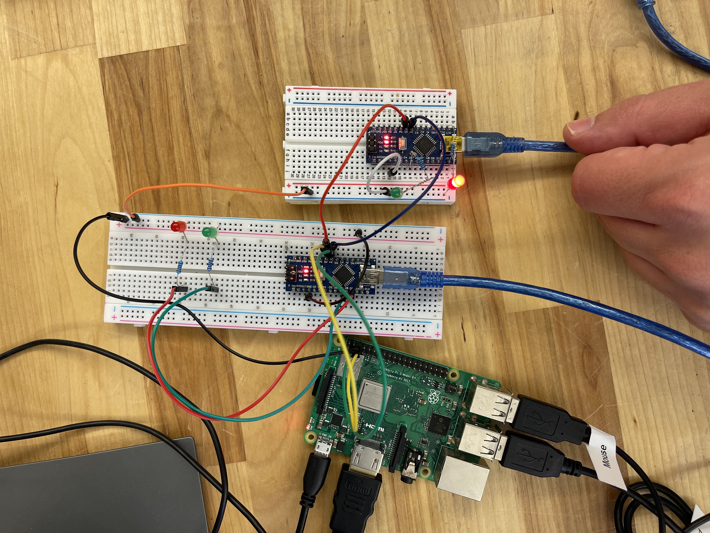
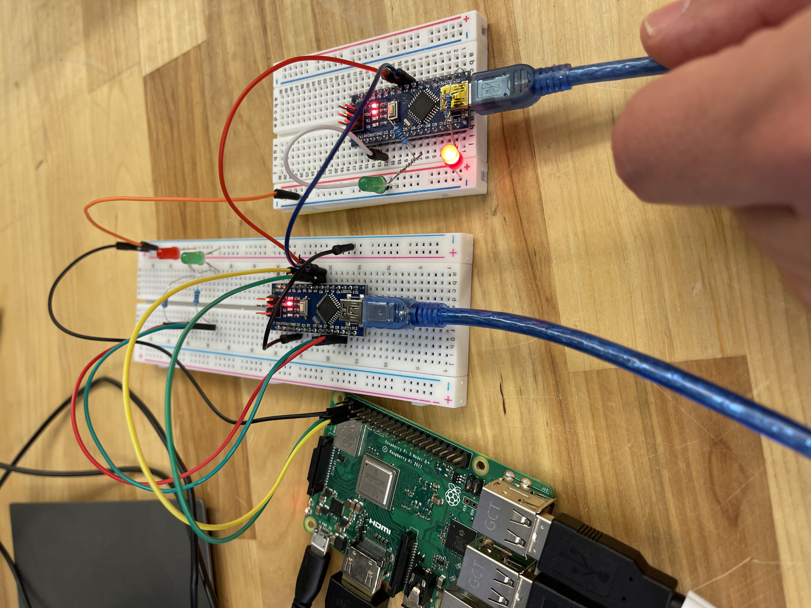
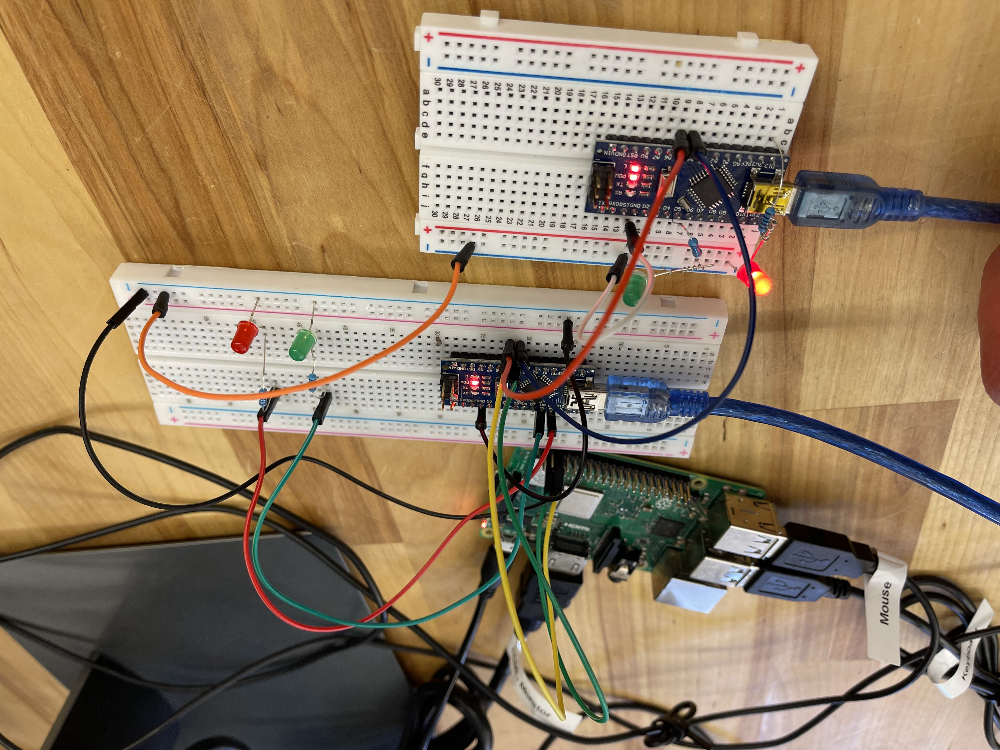

## Test Requirements:
Setup Raspberry pi to commuicate via I2C to the ATmega328P chip. The chip can either be on the helper board or standalone chip.  
    - Turn on two different LED would be a good test.  
    

## Big things to take away.

#### Python
**Device Address -** Arduino Address  
**Rigester Address -** Typically used for other items on the board but we can just send data  
**Data 0-255 -** Only need to use one byte.  
```python
bus.write_byte_data(ardunio_1, 0x01, 1) # turning the red on
```

https://www.electronicwings.com/raspberry-pi/python-based-i2c-functions-for-raspberry-pi

#### Arduino
Sets the device address.
```C++
Wire.begin(0x9);
```

5. Wiring Diagram(Hand written or drawen out).






